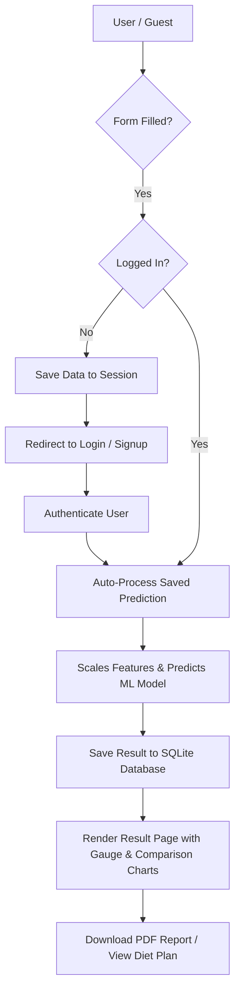
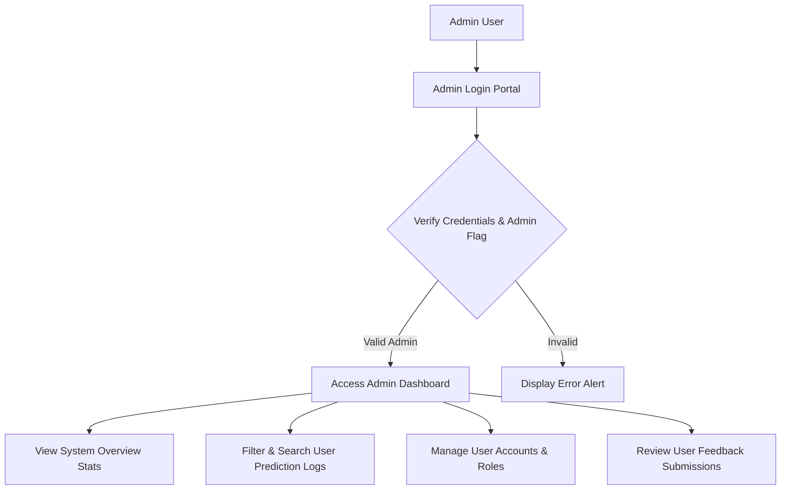
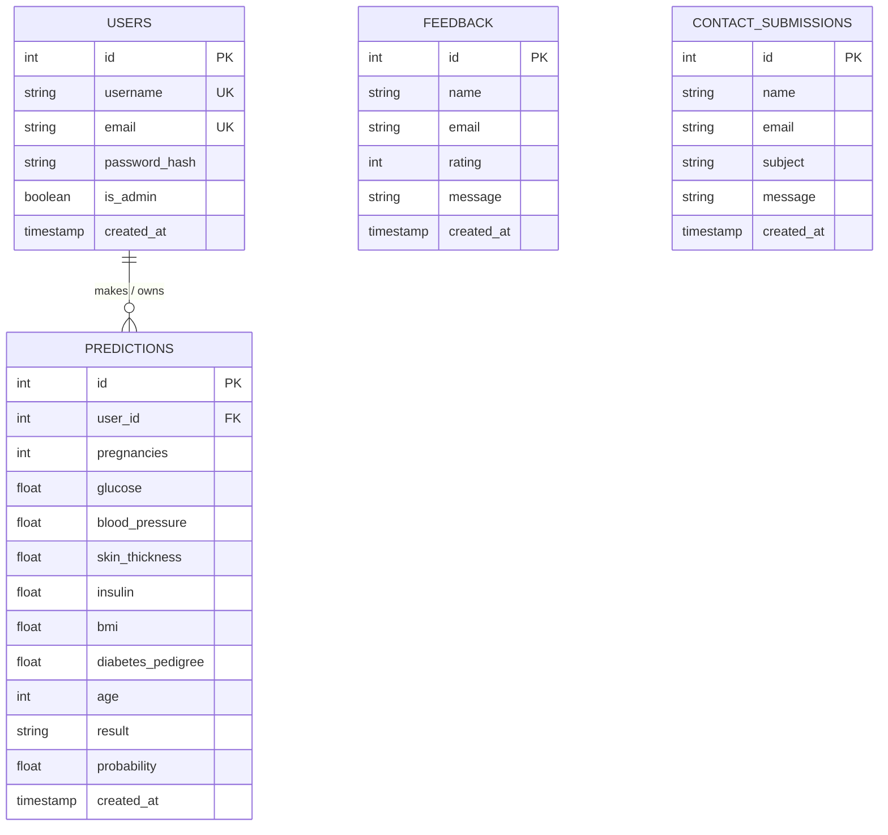

# Diabetes Detection System (DDS)
## A PROJECT REPORT ON

# **Diabetes Detection System (DDS)**

**SUBMITTED TO:**  
**Geetanjali College of Computer Science and Commerce (BBA) Saurashtra University Rajkot**

---

| FIELD | DETAILS |
| :--- | :--- |
| **FRONT END** | HTML5, CSS3, JavaScript, Bootstrap 5.3 |
| **BACK END** | Python 3, Flask, SQLite3, Scikit-Learn |
| **AFFILIATED BY** | Saurashtra University |
| **ACADEMIC YEAR** | 2025-2026 |
| **PROJECT GUIDE** | Prof. Harsh Joshi / Prof. Kishorsinh Vala |
| **PREPARED BY** | Atik Bhas & Jay Sitapara |

---

## Acknowledgement

- First and foremost, we are sincerely thankful to **Saurashtra University** for giving us the opportunity to work on this project as part of our curriculum.
- We extend our gratitude to **Geetanjali Group Of Colleges** for providing us with the resources and environment needed to develop our project.
- We are particularly grateful to our Head of Department, **Prof. Brijesh Shah**, for his constant support and guidance throughout the project.
- We would like to express our deepest appreciation to our project guide, **Prof. Kishorsinh Vala**, who guided us through the analysis and development phases of our project, providing invaluable advice and support.
- We are also thankful to all well-wishers and friends who supported us during the project development.

**Yours Faithfully,**  
**Atik Bhas & Jay Sitapara**

---

## Index

| SR.NO | TOPIC NAME | PAGE NO. |
| :---: | :--- | :---: |
| 1 | Project Profile | 1 |
| 2 | Project Requirement | 2 |
| 3 | Technology Requirement | 3 |
| 4 | Data Flow Diagram (DFD) | 4 |
| 5 | E-R Diagram (ERD) | 6 |
| 6 | Software Development Life Cycle (SDLC) | 7 |
| 7 | Data Dictionary | 8 |
| 8 | Test Cases | 10 |
| 9 | Screenshots & Feature Descriptions | 11 |
| 10 | Future Enhancement of Project | 32 |
| 11 | Webliography | 33 |

---

## 1. Project Profile

- **Project Title**: Diabetes Detection System (DDS)
- **Development Software**: Visual Studio Code
- **Front End**: HTML5, CSS3, JavaScript, Bootstrap 5.3, Bootstrap Icons
- **Back End**: Python 3, Flask, SQLite3
- **Machine Learning Engine**: Scikit-Learn (Random Forest Classifier, StandardScaler)
- **Academic Year**: 2025-2026 / 2026-2027
- **Developed By**: Atik Bhas & Jay Sitapara
- **Submitted To**: Geetanjali College of Computer Science and Commerce (BBA) Saurashtra University Rajkot
- **Documentation Tool**: Microsoft Word / Markdown / HTML
- **Operating System**: Windows 11 / macOS / Linux

---

## 2. Project Requirement

### Hardware Requirements

- **Processor**: Intel Core i3 or higher (or AMD Ryzen 3 / equivalent)
- **RAM**: 4 GB or more (8 GB recommended for ML training & chart rendering)
- **Hard Disk**: 500 GB or more (minimum 2 GB free disk space)
- **Display**: 1366 x 768 resolution or higher

---

## 3. Technology Requirement

- **Platform**: 64-bit, Dual-core, 1.6 GHz or higher.
- **Operating System**: Windows 11 / macOS / Linux
- **Front End Tools**: HTML5, CSS3, JavaScript (ES6+), Bootstrap 5.3, Bootstrap Icons
- **Back End Tools**: Python 3.10+, Flask 3.0+, Werkzeug, Flask-Login
- **Machine Learning & Data Tools**: Scikit-learn, Pandas, NumPy
- **Visualization & PDF Engines**: Matplotlib (Agg backend), Seaborn, ReportLab
- **Database Engine**: SQLite3
- **Editing Tool**: Visual Studio Code
- **Browser**: Google Chrome, Mozilla Firefox, Microsoft Edge, or any modern web browser

---

## 4. Data Flow Diagram (DFD)

### User Side DFD

### Admin Side DFD

---

## 5. E-R Diagram (ERD)

An **Entity-Relationship Diagram (ERD)** illustrates the data entities, attributes, and relationships between database models in the Diabetes Detection System.

---

## 6. Software Development Life Cycle (SDLC)

1. **Planning and Requirement Analysis**:
   - Defined system objectives: provide AI-driven diabetes screening based on 8 clinical parameters (Glucose, BP, BMI, Insulin, Skin Thickness, Pedigree, Pregnancies, Age).
   - Documented guest assessment flow, meal planning, PDF report generation, and admin management requirements.

2. **Design**:
   - Designed responsive Bootstrap 5 UI, interactive BMI calculator widget, parameter guidance accordion, and server-side Matplotlib chart generators.
   - Structured database schemas (`users`, `predictions`, `feedback`, `contact_submissions`).

3. **Development**:
   - Implemented Flask backend routing, Flask-Login authentication, Werkzeug password hashing, SQLite database connectivity, Scikit-learn RandomForest Classifier model training, and ReportLab PDF document building.

4. **Testing**:
   - Conducted rigorous unit, integration, and guest authentication workflow tests across desktop and mobile devices.

5. **Deployment**:
   - Configured virtual environment (`.venv`), auto-initialization script (`init_db.py`), and local server execution.

6. **Maintenance**:
   - Managed bug fixes, UI spacing fixes, AI watermark removals, and Git version control synchronization.

---

## 7. Data Dictionary

### 1. User Table (`users`)

| Field Name | Data Type | Constraints | Description |
| :--- | :--- | :--- | :--- |
| `id` | INTEGER | PRIMARY KEY, AUTOINCREMENT | Unique user identifier |
| `username` | TEXT | UNIQUE, NOT NULL | Account username |
| `email` | TEXT | UNIQUE, NOT NULL | User email address |
| `password_hash` | TEXT | NOT NULL | Werkzeug hashed password |
| `is_admin` | BOOLEAN | DEFAULT 0 | Admin privilege flag (1=Admin, 0=User) |
| `created_at` | TIMESTAMP | DEFAULT CURRENT_TIMESTAMP | Account creation timestamp |

### 2. Prediction Table (`predictions`)

| Field Name | Data Type | Constraints | Description |
| :--- | :--- | :--- | :--- |
| `id` | INTEGER | PRIMARY KEY, AUTOINCREMENT | Unique prediction record ID |
| `user_id` | INTEGER | FOREIGN KEY (users.id) | Foreign key referencing user |
| `pregnancies` | INTEGER | NOT NULL | Number of pregnancies |
| `glucose` | REAL | NOT NULL | Fasting plasma glucose (mg/dL) |
| `blood_pressure` | REAL | NOT NULL | Diastolic blood pressure (mm Hg) |
| `skin_thickness` | REAL | NOT NULL | Triceps skin fold thickness (mm) |
| `insulin` | REAL | NOT NULL | 2-Hour serum insulin (mu U/ml) |
| `bmi` | REAL | NOT NULL | Body Mass Index (kg/m²) |
| `diabetes_pedigree`| REAL | NOT NULL | Diabetes pedigree score |
| `age` | INTEGER | NOT NULL | Patient age in years |
| `result` | TEXT | NOT NULL | 'Diabetic' or 'Not Diabetic' |
| `probability` | REAL | NOT NULL | Risk probability percentage (0-100%) |
| `created_at` | TIMESTAMP | DEFAULT CURRENT_TIMESTAMP | Assessment timestamp |

### 3. Feedback Table (`feedback`)

| Field Name | Data Type | Constraints | Description |
| :--- | :--- | :--- | :--- |
| `id` | INTEGER | PRIMARY KEY, AUTOINCREMENT | Unique feedback ID |
| `name` | TEXT | NOT NULL | Submitter name |
| `email` | TEXT | NOT NULL | Submitter email |
| `rating` | INTEGER | NOT NULL | Rating score (1 to 5 stars) |
| `message` | TEXT | NOT NULL | User feedback comments |
| `created_at` | TIMESTAMP | DEFAULT CURRENT_TIMESTAMP | Submission timestamp |

### 4. Contact Submissions Table (`contact_submissions`)

| Field Name | Data Type | Constraints | Description |
| :--- | :--- | :--- | :--- |
| `id` | INTEGER | PRIMARY KEY, AUTOINCREMENT | Unique contact record ID |
| `name` | TEXT | NOT NULL | Sender full name |
| `email` | TEXT | NOT NULL | Sender email address |
| `subject` | TEXT | DEFAULT 'General Inquiry' | Message subject |
| `message` | TEXT | NOT NULL | Inquiry message content |
| `created_at` | TIMESTAMP | DEFAULT CURRENT_TIMESTAMP | Submission timestamp |

---

## 8. Test Cases

| Case Name | Case Description | Expected / Actual Output | Test Result |
| :--- | :--- | :--- | :---: |
| **User Registration** | Verify new user registration with valid username, email, and password. | User account created successfully and logged in. | **PASS** |
| **User Login** | Verify login with valid credentials (e.g. `demo_patient` / `user123`). | Redirects to dashboard/prediction page with welcome message. | **PASS** |
| **Invalid Login** | Verify login with wrong password or non-existent username. | Displays error message: *"Invalid username/email or password."* | **PASS** |
| **Guest Form Submission** | Verify an unauthenticated guest filling form metrics on home page. | Stores inputs in session, redirects to `/login` with prompt alert. | **PASS** |
| **Post-Login Auto Report** | Verify guest logging in after submitting form. | System auto-predicts, saves record, and opens `/result/<id>`. | **PASS** |
| **Instant BMI Calculator** | Verify height (170cm) and weight (70kg) inputs. | Calculates BMI = 24.2 kg/m² and auto-fills form field. | **PASS** |
| **ML Prediction Execution** | Submit clinical metrics (Glucose: 148, BP: 72, BMI: 33.6). | Model computes prediction class ('Diabetic') & probability (78.5%). | **PASS** |
| **PDF Report Download** | Click "Download PDF Health Report" on result page. | Generates and downloads formatted PDF report with embedded charts. | **PASS** |
| **Prediction History** | View history log page for logged-in user. | Displays chronological list of past screenings with date & results. | **PASS** |
| **Admin Dashboard** | Access `/admin` route as admin user (`Jay` or `Atik`). | Displays system stats, user list, prediction table, and feedback logs. | **PASS** |
| **Non-Admin Restricted Access**| Non-admin user attempting to access `/admin`. | Aborts with 403 Forbidden / Access Denied. | **PASS** |

---

## 9. Screenshots & Module Descriptions

### Module 1: Home Page & Embedded Assessment Form
- **Description**: The home page features a modern hero banner, live ML model status badge, key feature cards, and the **Diabetes Risk Assessment Form** accessible to both guest visitors and logged-in users.
- **Key Elements**: Hero banner, live status, instant BMI calculator widget, 8 clinical metric inputs, and parameter guidance sidebar.

### Module 2: Parameter Guidance Sidebar ("Don't Know Your Numbers?")
- **Description**: Clicking any clinical input field on the form dynamically highlights reference ranges, medical explanations, and testing steps in the guidance sidebar.

### Module 3: Instant BMI Calculator Widget
- **Description**: Allows users to input height in centimeters and weight in kilograms to instantly calculate their Body Mass Index (BMI) and auto-fill the form field.

### Module 4: Guest Form Submission & Auth Gate
- **Description**: When an unauthenticated visitor fills out the assessment form and clicks "Run Machine Learning Assessment", their inputs are safely saved into the Flask session and they are guided to log in or create an account.

### Module 5: User Login Page
- **Description**: Provides secure authentication using Werkzeug password hashing. Displays pre-configured demo account hints and pending assessment alerts when available.

### Module 6: User Registration (Sign Up) Page
- **Description**: Allows new users to create an account with username, email, and password validation.

### Module 7: Diabetes Risk Assessment Result Page
- **Description**: Displays the ML screening result ('Diabetic' / 'Not Diabetic'), probability percentage score, server-side Matplotlib risk gauge chart, and healthy baseline comparison chart.
- **Advisory Features**: Customized 7-day diabetic meal plan, lifestyle recommendations, and doctor consultation advisories.

### Module 8: Downloadable PDF Health Report
- **Description**: Generates a downloadable PDF report using ReportLab containing patient details, metric tables, risk charts, diet plan, and medical disclaimer.

### Module 9: Prediction History Page
- **Description**: Displays a chronological table of all past screenings performed by the authenticated user.

### Module 10: India & Global Diabetes Statistics Page
- **Description**: Dedicated statistics dashboard displaying clinical data for India (101M cases, 136M pre-diabetic, state rankings) and Global figures (537M cases, 44.7% undiagnosed rate, mortality stats).

### Module 11: Feedback Page
- **Description**: Allows users to submit star ratings and feedback comments regarding system accuracy and user experience.

### Module 12: Admin Panel & Dashboard
- **Description**: Role-protected admin dashboard featuring total user counters, diabetic ratio analytics, prediction log filtering, account management, and user feedback records.

---

## 10. Future Enhancement of Project

- **Real-Time Broker / EHR API Integration**: Connect with electronic health record (EHR) systems and diagnostic lab APIs for automatic metric ingestion.
- **Deep Learning Model Upgrade**: Implement Deep Neural Networks (DNN) and XGBoost models for enhanced predictive accuracy across diverse demographic datasets.
- **Wearable Device Synchronization**: Integrate real-time data sync with smartwatches and fitness trackers (Apple Health, Fitbit, Google Fit) for continuous glucose and activity tracking.
- **Multi-Language Support**: Provide multi-lingual localization (Hindi, Gujarati, Spanish, French, etc.) to expand healthcare accessibility.
- **Automated SMS & WhatsApp Alerts**: Send routine HbA1c test reminders, diet notifications, and follow-up consultation advisories directly to patient mobile numbers.

---

## 11. Webliography

- **Flask Documentation**: [https://flask.palletsprojects.com/](https://flask.palletsprojects.com/)
- **Scikit-Learn ML Library**: [https://scikit-learn.org/](https://scikit-learn.org/)
- **Bootstrap 5 Framework**: [https://getbootstrap.com/](https://getbootstrap.com/)
- **SQLite Database Engine**: [https://www.sqlite.org/](https://www.sqlite.org/)
- **ReportLab PDF Library**: [https://www.reportlab.com/](https://www.reportlab.com/)
- **Matplotlib Visualization Library**: [https://matplotlib.org/](https://matplotlib.org/)
- **International Diabetes Federation (IDF Atlas)**: [https://diabetesatlas.org/](https://diabetesatlas.org/)
- **ICMR-INDIAB Study Data**: [https://www.icmr.gov.in/](https://www.icmr.gov.in/)
- **Project Repository**: [https://github.com/Atikbhas/Diabetes-Detection-System](https://github.com/Atikbhas/Diabetes-Detection-System)
